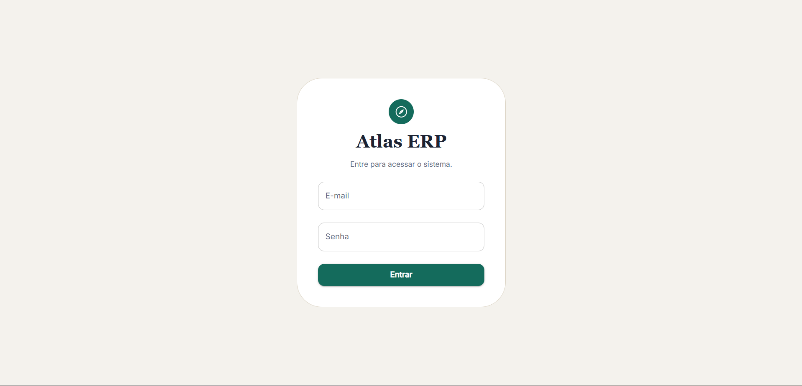
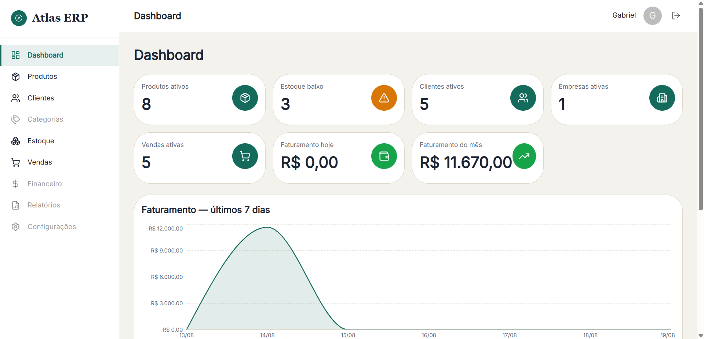
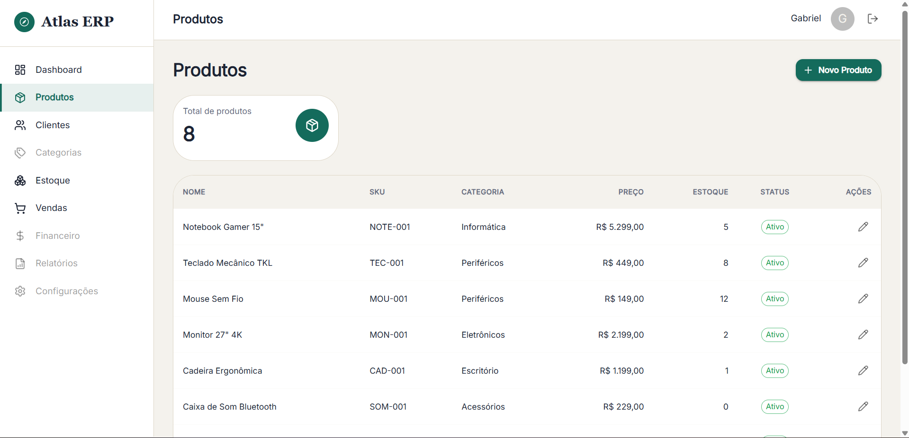
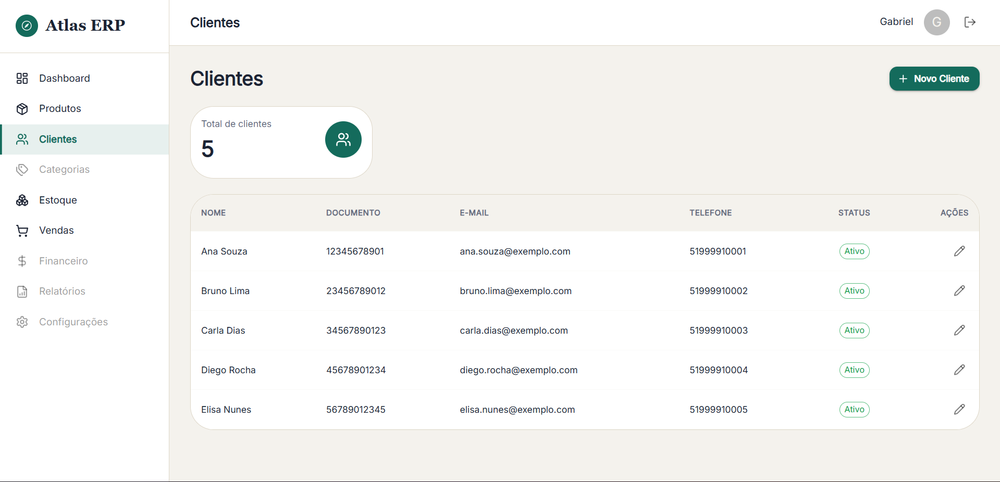
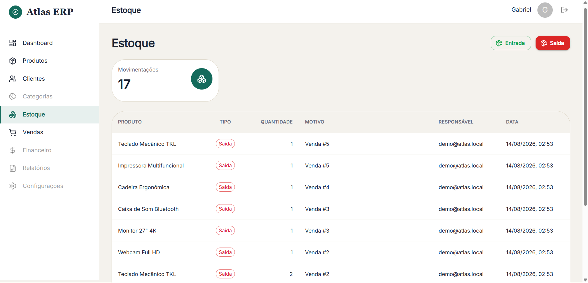
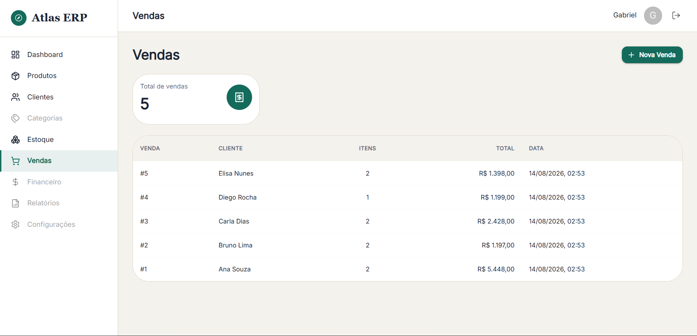

# Atlas ERP

> Sistema ERP modular para pequenas e médias empresas — monorepo com **backend Spring Boot 3** (Java 21) e **frontend React 19** (TypeScript).

O Atlas ERP cobre cadastro de produtos, clientes, categorias, usuários e empresas, controle de estoque e vendas, com autenticação JWT e controle de acesso por papel (RBAC). É um projeto de portifólio em evolução: a fundação (autenticação, RBAC, testes), todos os módulos de negócio com UI própria e a identidade visual estão completos e validados de ponta a ponta.

## Status do projeto

| Área | Status |
|---|---|
| Autenticação JWT (login/logout, rotas protegidas) | ✅ Completa e testada |
| Rate limiting em `POST /auth/login` | ✅ Completo e testado (mitigação de força bruta) |
| RBAC — papéis `ADMIN`/`USER` (backend `@PreAuthorize` + reflexo na UI) | ✅ Completo e testado |
| Produtos — CRUD completo (listar, criar, editar, excluir = inativação) | ✅ Completo e testado |
| Clientes — CRUD completo (exclusão = inativação, filtrada no backend) | ✅ Completo e testado |
| Categorias — CRUD completo (exclusão = inativação) | ✅ Completo e testado |
| Empresas — CRUD completo (ADMIN-only) | ✅ Completo e testado |
| Usuários — CRUD completo (ADMIN-only) | ✅ Completo e testado |
| Dashboard com dados reais (indicadores, gráfico, listas) | ✅ Funcional |
| Vendas — registro, listagem e cancelamento (ADMIN), sem N+1 na listagem | ✅ Completo e testado |
| Estoque — entrada/saída e histórico paginado | ✅ Completo e testado |
| Dados de demonstração (Sprint P4) | ✅ Idempotente, ativado por `DEMO_DATA=true` |
| Identidade visual (rebrand — CompassMark, tema, tokens) | ✅ Concluído em todas as telas |
| Responsividade e acessibilidade (Sidebar → Drawer mobile, alvos de toque) | ✅ Concluído |
| Multi-tenancy (Empresa) | 📋 Modelado no domínio, não aplicado |
| Testes automatizados | ✅ 137 backend + 71 frontend |
| CI/CD | ✅ Workflow configurado (lint + testes + build em cada PR) |
| Containerização | ✅ Compose completo (postgres + backend + frontend + pgAdmin) |

Veja o [Roadmap](docs/ROADMAP.md) e o [Backlog](docs/PRODUCT_BACKLOG.md).

## Funcionalidades existentes

- **Autenticação**: login/logout com JWT stateless; senha armazenada com bcrypt (mínimo 8 caracteres); rotas protegidas no frontend e endpoints protegidos no backend. `POST /auth/login` tem rate limiting em memória por IP (5 tentativas / 60s por padrão, configurável, `429` ao exceder).
- **RBAC**: `register` público cria **sempre** usuário `USER` (nunca `ADMIN`). O backend autoriza por papel via `@PreAuthorize` (excluir é `ADMIN`-only); a UI reflete isso (ex.: oculta o botão "Excluir" para `USER`). Um `403` não derruba a sessão.
- **Produtos**: CRUD completo com validação (Zod + backend), categoria obrigatória, estoque mínimo, erros de SKU duplicado exibidos na UI. Exclusão é **inativação** (`active = false`), não remoção física — produto pode estar referenciado em vendas/movimentos de estoque.
- **Clientes**: CRUD completo com CPF/CNPJ único, e-mail validado. Exclusão é **inativação** (`active = false`); `GET /customers` já retorna apenas clientes ativos (filtro no backend).
- **Categorias**: CRUD completo; exclusão também é inativação (produto referencia categoria por FK não-nula).
- **Empresas** e **Usuários**: CRUD completo, telas `ADMIN`-only (rota e menu só aparecem para esse papel; backend também nega `403` para `USER`).
- **Dashboard**: métricas reais (total de produtos/clientes, baixo estoque, vendas recentes, receita dos últimos 7 dias) com gráfico.
- **Vendas**: registro com cliente + itens dinâmicos (produto e quantidade, total calculado pelo backend), listagem com total/data (sem N+1 — itens de todas as vendas carregados em lote) e cancelamento (ADMIN-only) que restaura o estoque.
- **Estoque**: entrada e saída com motivo obrigatório, e histórico paginado (10/página) com tipo (Entrada/Saída), responsável e data.
- **Dados de demonstração**: com `DEMO_DATA=true`, o backend cria na subida empresa, categorias, produtos, clientes, vendas e movimentos de estoque de exemplo — idempotente e não-destrutivo (insere apenas o que ainda não existe), para demonstrar Dashboard, Vendas e Estoque já com dados.
- **Identidade visual**: rebrand completo (marca "bússola" — `CompassMark` — reaparecendo no favicon, Sidebar e login; tema/tokens próprios em `core/theme`) aplicado em todas as telas.
- **Responsividade e acessibilidade**: Sidebar vira `Drawer` temporário (menu hambúrguer no Header) abaixo do breakpoint `md`; layout, diálogos e tabelas ajustados para mobile (375px) e tablet (768px), além de desktop.

## Stack

**Backend** (`atlas-backend/`)
- Java 21 · Spring Boot 3.5 · Spring Security · Spring Data JPA
- PostgreSQL 17 · Flyway (migrations versionadas)
- JWT (JJWT, HS256, stateless) · bcrypt
- springdoc-openapi (Swagger UI em `/swagger-ui.html`)
- Maven (wrapper `mvnw`)

**Frontend** (`atlas-frontend/`)
- React 19 · TypeScript · Vite 8
- MUI (Material UI) 7 · Emotion
- React Router 7 · TanStack Query 5
- React Hook Form + Zod · Axios

**Infraestrutura**
- Docker Compose (`docker/docker-compose.yml`) — PostgreSQL + pgAdmin para desenvolvimento local

## Arquitetura

- **Backend**: camadas `controller → service → repository`, com `entity`, `dto`, `mapper`, `security` e `exception`. Migrations Flyway versionadas; `ddl-auto: validate`. Segurança stateless com filtro JWT + `@PreAuthorize`.
- **Frontend**: padrão de feature por domínio (`features/<módulo>/{components,hooks,pages,services,types}`), com estado de servidor via TanStack Query e formulários tipados (react-hook-form + Zod).

Detalhes em [docs/architecture.md](docs/architecture.md), [docs/SECURITY.md](docs/SECURITY.md) e [docs/API_GUIDELINES.md](docs/API_GUIDELINES.md).

## Testes

| Suíte | Comando | Resultado |
|---|---|---|
| Backend (unit + integração com Testcontainers) | `cd atlas-backend && ./mvnw test` | ✅ 137 testes |
| Frontend (vitest + React Testing Library) | `cd atlas-frontend && npm test` | ✅ 71 testes |
| Lint / build | `npm run lint` · `npm run build` | ✅ |

Os testes de integração do backend sobem um PostgreSQL efêmero via Testcontainers (isolado do banco de desenvolvimento) e rodam as migrations Flyway reais.

## Como executar localmente

Pré-requisitos: Docker, JDK 21, Node.js 20+.

```bash
# 1. Suba o PostgreSQL (+ pgAdmin opcional)
cd docker
cp .env.example .env  # credenciais obrigatórias — o compose falha se o .env não existir
docker compose up -d postgres
```

> ℹ️ **Volume do Postgres:** a partir da Sprint P3 o Compose usa um volume dedicado (`atlas_erp_postgres_data`), inicializado na primeira subida com as credenciais do `docker/.env`. O volume antigo (`docker_postgres_data`, criado com `atlas123`) fica **preservado no disco**, apenas não montado pelo Compose. Para o backend local (`./mvnw spring-boot:run`), use as mesmas credenciais do postgres do Compose — ex.: `export DB_PASSWORD=CHANGE_ME_DB_PASSWORD`, ou o valor de `POSTGRES_PASSWORD` definido no seu `docker/.env`.

```bash
# 2. Backend (porta 8080) — em outro terminal
cd atlas-backend
./mvnw spring-boot:run
# Swagger UI: http://localhost:8080/swagger-ui.html

# 3. Frontend (porta 5173) — em outro terminal
cd atlas-frontend
npm install
npm run dev
# App: http://localhost:5173
```

### Dados de demonstração (Sprint P4)

Para popular o banco com dados de demonstração (empresa, categorias, produtos, clientes, vendas e movimentos de estoque) na subida do backend:

```bash
export DEMO_DATA=true
./mvnw spring-boot:run
```

O runner é **inerte** sem `DEMO_DATA=true` e **idempotente** — insere apenas o que ainda não existe (nunca altera nem remove dados existentes), então pode ficar ligado no dia a dia de desenvolvimento. Na stack em containers, defina `DEMO_DATA=true` no `docker/.env` para ativá-la.

### Stack completa em containers (Docker Compose)

Para rodar **tudo** — PostgreSQL, backend e frontend — em containers, sem JDK/Node local:

```bash
cd docker
cp .env.example .env   # ajuste POSTGRES_PASSWORD, JWT_SECRET e ADMIN_BOOTSTRAP_*
docker compose up --build
```

- **App**: http://localhost:3000 (frontend via nginx)
- **Backend / Swagger**: http://localhost:8080/swagger-ui.html
- **pgAdmin**: http://localhost:5050

> O frontend (nginx) faz proxy reverso de `/api` para o backend — o bundle é construído com `VITE_API_URL=/api`. O backend do Compose conecta no postgres do próprio Compose pela rede interna (`postgres:5432`), com as credenciais do `docker/.env`.
>
> 🔑 Na primeira subida de uma instalação nova, defina `ADMIN_BOOTSTRAP_EMAIL`/`ADMIN_BOOTSTRAP_PASSWORD` no `docker/.env` para criar o primeiro ADMIN (idempotente); remova depois.

### Variáveis de ambiente

O backend lê configuração de variáveis de ambiente, com defaults DEV-ONLY fictícios no `application.yml`. Para personalizar, use o modelo em [`.env.example`](.env.example) (nenhum valor real é versionado):

| Variável | Default | Descrição |
|---|---|---|
| `DB_URL` | `jdbc:postgresql://localhost:5432/atlas_erp` | URL do banco |
| `DB_USERNAME` / `DB_PASSWORD` | `atlas` / `CHANGE_ME_DB_PASSWORD` | Credenciais do banco |
| `JWT_SECRET` | placeholder DEV-ONLY | Secret de assinatura HS256 (≥ 32 bytes; gere com `openssl rand -base64 48`) |
| `JWT_EXPIRATION` | `86400000` | Validade do token em ms |
| `ADMIN_BOOTSTRAP_EMAIL` / `ADMIN_BOOTSTRAP_PASSWORD` / `ADMIN_BOOTSTRAP_NAME` | — | Cria o primeiro ADMIN (ver abaixo) |
| `DEMO_DATA` | `false` | Ativa o `DemoDataRunner` — dados de demonstração idempotentes (ver acima) |

O `docker-compose.yml` também usa variáveis (`POSTGRES_DB`, `POSTGRES_USER`, `POSTGRES_PASSWORD`, `PGADMIN_DEFAULT_EMAIL`, `PGADMIN_DEFAULT_PASSWORD`).

> O perfil padrão **não loga SQL** (Hibernate). Para ver o SQL gerado em desenvolvimento, rode o backend com o perfil `dev`: `SPRING_PROFILES_ACTIVE=dev ./mvnw spring-boot:run`.

**Como configurar o `.env` a partir do `.env.example`:**

1. Copie o modelo da raiz: `cp .env.example .env` e edite os valores do seu ambiente (o `.env` é ignorado pelo Git — nenhum valor real é versionado).
2. **O Spring Boot não lê `.env` automaticamente**: as variáveis precisam estar no ambiente do processo do backend. Exporte no terminal antes do `mvnw` (ex.: `export DB_PASSWORD=...`) ou configure-as na sua IDE.
3. **O `docker compose` lê o `.env` do diretório onde está o compose** automaticamente: rodando `cd docker && docker compose up`, ele carrega `docker/.env`. Crie `docker/.env` com as variáveis `POSTGRES_*`/`PGADMIN_*` do modelo da raiz.

### Como criar o primeiro ADMIN

Desde a implementação do RBAC, o `register` público cria apenas `USER` — e `POST /users` (que cria `ADMIN`) é exclusivo de `ADMIN`. Para uma instalação nova, defina as variáveis de bootstrap **antes** da primeira subida do backend:

```bash
export ADMIN_BOOTSTRAP_EMAIL=admin@minhaempresa.com
export ADMIN_BOOTSTRAP_PASSWORD='uma-senha-forte'
./mvnw spring-boot:run
```

Na subida, o backend cria o usuário `ADMIN` (bcrypt). **Idempotente**: se o e-mail já existir, nada é feito. Depois de criar, remova as variáveis.

## Screenshots

Capturas do estado atual, pós-rebrand (mais em [`docs/demo/current/`](docs/demo/current/); versões anteriores em [`docs/demo/archive/`](docs/demo/archive/)):

| | |
|---|---|
|  |  |
|  |  |
|  |  |

## Roadmap / limitações

- Todos os módulos de negócio já têm UI própria — Categorias, Empresas e Usuários (antes backend-only) foram concluídos numa sprint de fechamento.
- Vendas sem paginação e sem listagem de vendas canceladas — o `GET /sales` retorna apenas as ativas.
- Histórico de estoque sem filtro por produto.
- Multi-tenancy modelado, não aplicado.
- Sem refresh token — sessão expira em 24h fixas, sem renovação nem revogação (ver [SECURITY.md](docs/SECURITY.md)).
- Paginação/busca nas listagens.
- CI configurado (`.github/workflows/ci.yml`); validação em PR real pendente de push.
- Containerização completa concluída na Sprint P3; dados de demonstração (Sprint P4) concluídos e ativáveis via `DEMO_DATA=true`; identidade visual (rebrand) concluída em todas as telas.

Veja o [Roadmap](docs/ROADMAP.md) e o [Backlog](docs/PRODUCT_BACKLOG.md) para o plano detalhado.

## Licença

Distribuído sob a [Licença MIT](LICENSE).
