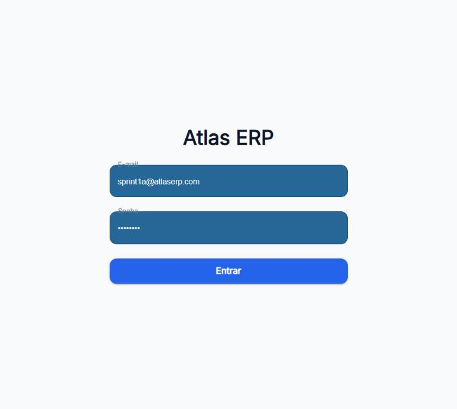
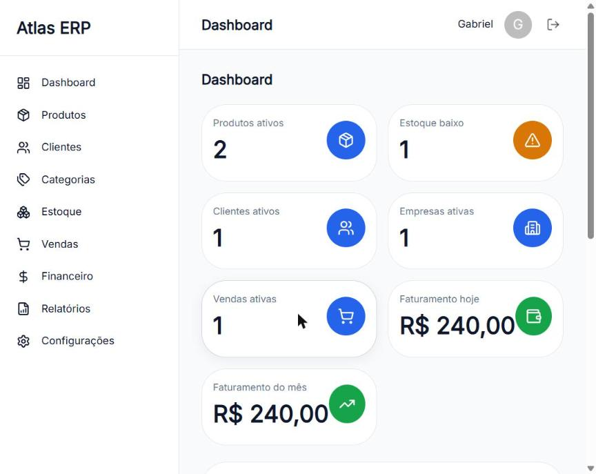
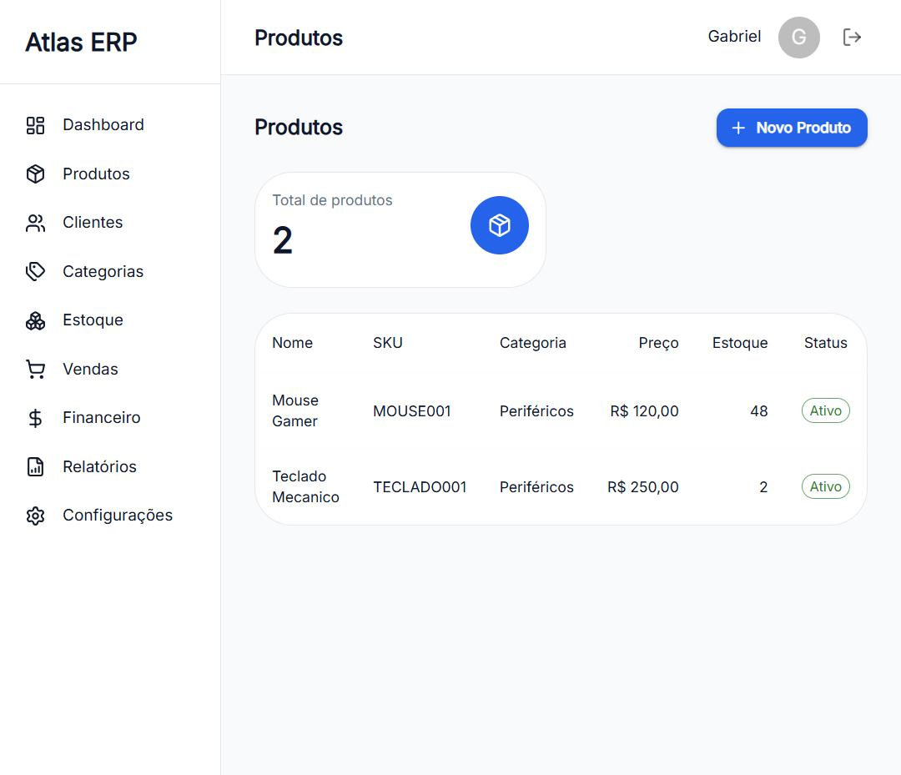
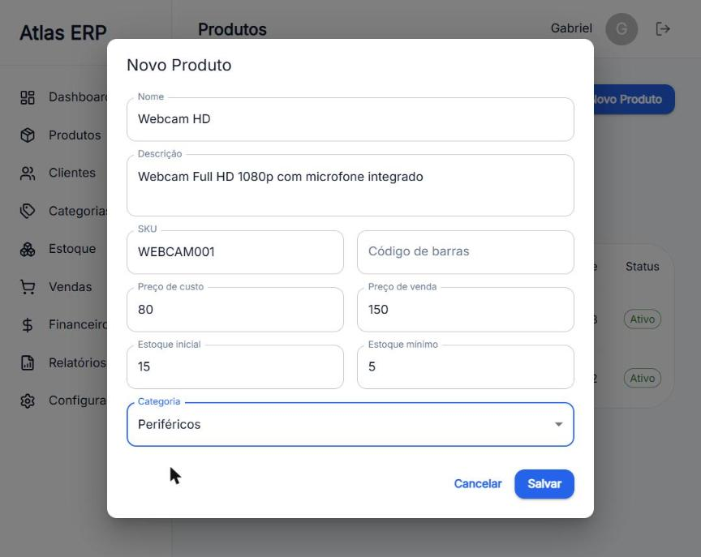

# Atlas ERP

> Sistema ERP modular para pequenas e médias empresas — monorepo com **backend Spring Boot 3** (Java 21) e **frontend React 19** (TypeScript).

O Atlas ERP cobre cadastro de produtos, clientes e categorias, controle de estoque, vendas, usuários e empresas, com autenticação JWT e controle de acesso por papel (RBAC). É um projeto de estudo/produção em evolução: a fundação (autenticação, RBAC, testes) e os módulos de Produtos e Clientes estão completos e validados de ponta a ponta.

## Status do projeto

| Área | Status |
|---|---|
| Autenticação JWT (login/logout, rotas protegidas) | ✅ Completa e testada |
| RBAC — papéis `ADMIN`/`USER` (backend `@PreAuthorize` + reflexo na UI) | ✅ Completo e testado |
| Produtos — CRUD completo (listar, criar, editar, excluir) | ✅ Completo e testado |
| Clientes — CRUD completo (exclusão = inativação) | ✅ Completo e testado |
| Dashboard com dados reais (indicadores, gráfico, listas) | ✅ Funcional |
| Categorias, Estoque, Vendas, Empresas, Usuários | ⚙️ Backend implementado — UI pendente |
| Multi-tenancy (Empresa) | 📋 Modelado no domínio, não aplicado |
| Testes automatizados | ✅ 83 backend + 47 frontend |
| CI/CD | 📋 Não configurado (próximo passo) |

Veja o [Roadmap](docs/ROADMAP.md) e o [Backlog](docs/PRODUCT_BACKLOG.md).

## Funcionalidades existentes

- **Autenticação**: login/logout com JWT stateless; senha armazenada com bcrypt; rotas protegidas no frontend e endpoints protegidos no backend.
- **RBAC**: `register` público cria **sempre** usuário `USER` (nunca `ADMIN`). O backend autoriza por papel via `@PreAuthorize` (excluir é `ADMIN`-only); a UI reflete isso (ex.: oculta o botão "Excluir" para `USER`). Um `403` não derruba a sessão.
- **Produtos**: CRUD completo com validação (Zod + backend), categoria obrigatória, estoque mínimo, erros de SKU duplicado exibidos na UI. Exclusão é física (`DELETE`).
- **Clientes**: CRUD completo com CPF/CNPJ único, e-mail validado. Exclusão é **inativação** (`active = false`); a listagem e o métrico consideram apenas clientes ativos (decisão documentada — filtrar no backend é débito conhecido).
- **Dashboard**: métricas reais (total de produtos/clientes, baixo estoque, vendas recentes, receita dos últimos 7 dias) com gráfico.
- **Backend exposto**: categorias, estoque (movimentações), vendas (com itens e status), empresas e usuários têm endpoints implementados (parte sem UI ainda).

## Stack

**Backend** (`atlas-backend/`)
- Java 21 · Spring Boot 3.5 · Spring Security · Spring Data JPA
- PostgreSQL 17 · Flyway (migrations versionadas)
- JWT (JJWT, HS256, stateless) · bcrypt
- springdoc-openapi (Swagger UI em `/swagger-ui.html`)
- Maven (wrapper `mvnw`)

**Frontend** (`atlas-frontend/`)
- React 19 · TypeScript · Vite 8
- MUI (Material UI) 7 · Emotion
- React Router 7 · TanStack Query 5
- React Hook Form + Zod · Axios

**Infraestrutura**
- Docker Compose (`docker/docker-compose.yml`) — PostgreSQL + pgAdmin para desenvolvimento local

## Arquitetura

- **Backend**: camadas `controller → service → repository`, com `entity`, `dto`, `mapper`, `security` e `exception`. Migrations Flyway versionadas; `ddl-auto: validate`. Segurança stateless com filtro JWT + `@PreAuthorize`.
- **Frontend**: padrão de feature por domínio (`features/<módulo>/{components,hooks,pages,services,types}`), com estado de servidor via TanStack Query e formulários tipados (react-hook-form + Zod).

Detalhes em [docs/architecture.md](docs/architecture.md), [docs/SECURITY.md](docs/SECURITY.md) e [docs/API_GUIDELINES.md](docs/API_GUIDELINES.md).

## Testes

| Suíte | Comando | Resultado |
|---|---|---|
| Backend (unit + integração com Testcontainers) | `cd atlas-backend && ./mvnw test` | ✅ 83 testes |
| Frontend (vitest + React Testing Library) | `cd atlas-frontend && npm test` | ✅ 47 testes |
| Lint / build | `npm run lint` · `npm run build` | ✅ |

Os testes de integração do backend sobem um PostgreSQL efêmero via Testcontainers (isolado do banco de desenvolvimento) e rodam as migrations Flyway reais.

## Como executar localmente

Pré-requisitos: Docker, JDK 21, Node.js 20+.

```bash
# 1. Suba o PostgreSQL (+ pgAdmin opcional)
cd docker
docker compose up -d postgres
```

> ⚠️ **Já tinha o volume do Postgres?** O `POSTGRES_PASSWORD` do compose só define a senha na **primeira** inicialização do volume. Se o `postgres_data` já existe (criado com `atlas123`, como no `docker-compose` original), o Postgres **continua autenticando com a senha antiga** — não é preciso recriar nada. Antes do passo 2, apenas aponte o backend para a mesma senha: `export DB_PASSWORD=atlas123`. Só recrie o volume (`docker compose down -v && docker compose up -d postgres`) se você **quiser** de fato trocar as credenciais.

```bash
# 2. Backend (porta 8080) — em outro terminal
cd atlas-backend
./mvnw spring-boot:run
# Swagger UI: http://localhost:8080/swagger-ui.html

# 3. Frontend (porta 5173) — em outro terminal
cd atlas-frontend
npm install
npm run dev
# App: http://localhost:5173
```

### Variáveis de ambiente

O backend lê configuração de variáveis de ambiente, com defaults DEV-ONLY fictícios no `application.yml`. Para personalizar, use o modelo em [`.env.example`](.env.example) (nenhum valor real é versionado):

| Variável | Default | Descrição |
|---|---|---|
| `DB_URL` | `jdbc:postgresql://localhost:5432/atlas_erp` | URL do banco |
| `DB_USERNAME` / `DB_PASSWORD` | `atlas` / `CHANGE_ME_DB_PASSWORD` | Credenciais do banco |
| `JWT_SECRET` | placeholder DEV-ONLY | Secret de assinatura HS256 (≥ 32 bytes; gere com `openssl rand -base64 48`) |
| `JWT_EXPIRATION` | `86400000` | Validade do token em ms |
| `ADMIN_BOOTSTRAP_EMAIL` / `ADMIN_BOOTSTRAP_PASSWORD` / `ADMIN_BOOTSTRAP_NAME` | — | Cria o primeiro ADMIN (ver abaixo) |

O `docker-compose.yml` também usa variáveis (`POSTGRES_DB`, `POSTGRES_USER`, `POSTGRES_PASSWORD`, `PGADMIN_DEFAULT_EMAIL`, `PGADMIN_DEFAULT_PASSWORD`).

**Como configurar o `.env` a partir do `.env.example`:**

1. Copie o modelo da raiz: `cp .env.example .env` e edite os valores do seu ambiente (o `.env` é ignorado pelo Git — nenhum valor real é versionado).
2. **O Spring Boot não lê `.env` automaticamente**: as variáveis precisam estar no ambiente do processo do backend. Exporte no terminal antes do `mvnw` (ex.: `export DB_PASSWORD=...`) ou configure-as na sua IDE.
3. **O `docker compose` lê o `.env` do diretório onde está o compose** automaticamente: rodando `cd docker && docker compose up`, ele carrega `docker/.env`. Crie `docker/.env` com as variáveis `POSTGRES_*`/`PGADMIN_*` do modelo da raiz.

### Como criar o primeiro ADMIN

Desde a implementação do RBAC, o `register` público cria apenas `USER` — e `POST /users` (que cria `ADMIN`) é exclusivo de `ADMIN`. Para uma instalação nova, defina as variáveis de bootstrap **antes** da primeira subida do backend:

```bash
export ADMIN_BOOTSTRAP_EMAIL=admin@minhaempresa.com
export ADMIN_BOOTSTRAP_PASSWORD='uma-senha-forte'
./mvnw spring-boot:run
```

Na subida, o backend cria o usuário `ADMIN` (bcrypt). **Idempotente**: se o e-mail já existir, nada é feito. Depois de criar, remova as variáveis.

## Screenshots

Algumas capturas do estado atual (mais em [`docs/demo/`](docs/demo/)):

| | |
|---|---|
|  |  |
|  |  |

## Roadmap / limitações

- Módulos sem UI ainda: Categorias, Estoque, Vendas, Empresas, Usuários (backends prontos).
- Multi-tenancy modelado, não aplicado.
- Filtrar clientes inativos no backend (hoje é feito no frontend).
- Paginação/busca nas listagens.
- CI/CD e conteinerização completa do app (próximos passos planejados).

Veja o [Roadmap](docs/ROADMAP.md) e o [Backlog](docs/PRODUCT_BACKLOG.md) para o plano detalhado.

## Licença

Distribuído sob a [Licença MIT](LICENSE).
