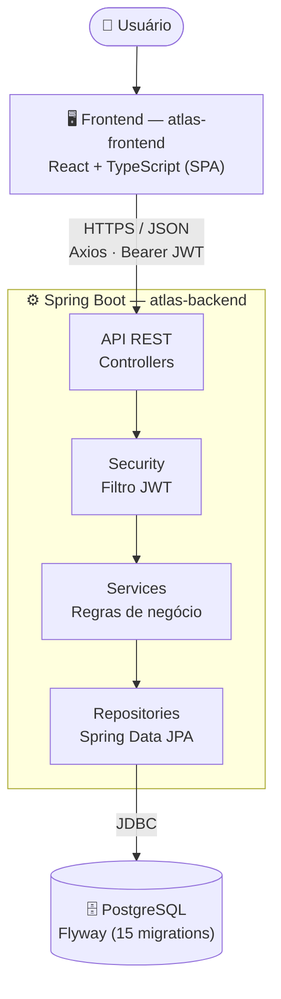

# Diagrama de Arquitetura — Atlas ERP

Fluxo de uma requisição, do usuário ao banco de dados. Mesmo diagrama presente em [PROJECT_OVERVIEW.md](PROJECT_OVERVIEW.md#arquitetura), isolado aqui para uso direto em slides.

## Leitura do diagrama

| Camada | Responsabilidade | Regra |
|---|---|---|
| **Frontend** | Interface, roteamento, cache local de dados (TanStack Query) | Nunca calcula regra de negócio — só exibe o que a API retorna |
| **API (Controllers)** | Recebe HTTP, valida formato de entrada (`@Valid`) | Nunca contém regra de negócio — delega ao Service |
| **Security (Filtro JWT)** | Valida o token `Authorization: Bearer`, popula o contexto de autenticação | Stateless — nenhuma sessão guardada no servidor |
| **Services** | Regra de negócio (ex.: "SKU não pode se repetir", "estoque não pode ficar negativo") | Única camada onde regra de negócio pode existir |
| **Repositories** | Acesso a dados via Spring Data JPA | Sem SQL manual — interfaces derivadas ou `@Query` JPQL |
| **PostgreSQL** | Persistência | Schema controlado por migrations Flyway versionadas, nunca `ddl-auto: update` |

## Por que essa forma (e não outra)

- **Sem gateway/API Gateway**: um único backend, um único frontend — a complexidade de um gateway não se paga na escala atual do projeto.
- **Sem microsserviços**: o domínio (produtos, clientes, estoque, vendas) é coeso e pequeno o suficiente para um monólito bem modularizado internamente (por camada, não por serviço separado). Extrair serviços agora seria complexidade prematura.
- **Sem fila/mensageria**: todas as operações hoje são síncronas e cabem numa transação de banco relacional simples (ex.: criar venda + dar baixa em estoque, na mesma transação).
- **REST em vez de GraphQL**: contrato simples, um recurso por endpoint, adequado ao volume de campos por entidade — não há problema de over-fetching que justifique GraphQL aqui.

Essas são decisões conscientes de escopo, não limitações técnicas — ver [POSSIBLE_QUESTIONS.md](POSSIBLE_QUESTIONS.md) para como defender essa escolha em banca.
