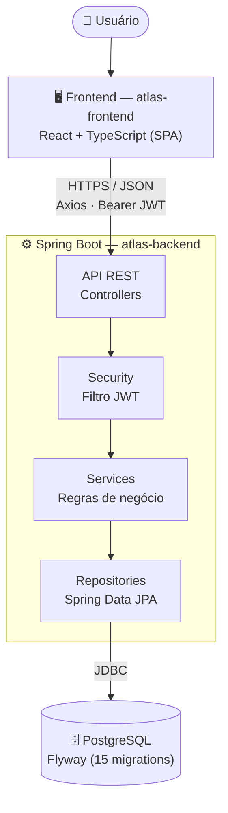

# Atlas ERP — Visão Geral do Projeto

> Documento de apoio para a reunião de acompanhamento do TCC. Resume objetivo, problema, arquitetura, tecnologias e estado real do projeto — sem otimismo de marketing: o que está pronto está pronto, o que não está é declarado como tal.

## Objetivo

O Atlas ERP é um sistema de gestão empresarial (ERP) web, construído como projeto de conclusão de curso, com o objetivo de aplicar — em um sistema real, íntegro de ponta a ponta — os fundamentos de engenharia de software normalmente vistos de forma fragmentada ao longo do curso: modelagem de domínio, projeto de API REST, autenticação e autorização, persistência com controle de schema versionado, e construção de uma interface web moderna consumindo essa API.

Mais do que "mais um CRUD", o projeto foi conduzido como um exercício deliberado de **processo de engenharia**: cada incremento (sprint) tem escopo declarado antes do código ser escrito, é validado (build, testes, teste manual ponta a ponta) antes de ser considerado concluído, e é documentado no mesmo commit em que é entregue. Essa disciplina de processo é, em si, parte do que o projeto pretende demonstrar — ver [Diferenciais técnicos](#diferenciais-técnicos).

## Problema que resolve

Pequenas e médias empresas frequentemente gerenciam produtos, clientes, estoque e vendas em planilhas soltas, sem integração entre si e sem histórico auditável. Isso gera três problemas recorrentes:

1. **Falta de visão consolidada** — não existe um lugar único que responda "quantos produtos estão com estoque baixo agora?" ou "qual o faturamento de hoje?" sem trabalho manual de consolidação.
2. **Dados duplicados e divergentes** — a mesma informação (ex.: estoque de um produto) vive em múltiplas planilhas que saem de sincronia.
3. **Nenhuma regra de negócio garantida** — nada impede, por exemplo, vender mais unidades do que existe em estoque, ou cadastrar dois produtos com o mesmo SKU, quando o controle é manual.

O Atlas ERP resolve isso centralizando produtos, clientes, categorias, estoque e vendas em um único sistema, com um backend que **garante as regras de negócio no servidor** (não confiando na interface para isso) e um dashboard que agrega os indicadores operacionais em tempo real, calculados a partir do dado de origem — nunca digitados manualmente.

## Tecnologias utilizadas

### Backend (`atlas-backend/`)
| Tecnologia | Uso |
|---|---|
| Java 21 | Linguagem |
| Spring Boot 3.5.4 | Framework de aplicação |
| Spring Security | Autenticação e filtro de requisições |
| Spring Data JPA / Hibernate | Persistência |
| PostgreSQL 17 | Banco de dados relacional |
| Flyway | Versionamento de schema (15 migrations) |
| JJWT 0.12.7 (HS256) | Emissão e validação de JWT |
| springdoc-openapi | Documentação interativa (Swagger UI) |
| Maven | Build e gerenciamento de dependências |

### Frontend (`atlas-frontend/`)
| Tecnologia | Uso |
|---|---|
| React 19 + TypeScript | Biblioteca de UI e tipagem estática |
| Vite 8 | Build tool e dev server |
| Material UI (MUI) 7 | Design system de componentes |
| React Router 7 | Roteamento client-side |
| TanStack Query 5 | Cache e sincronização de dados assíncronos |
| React Hook Form + Zod | Formulários e validação client-side |
| Axios | Cliente HTTP |
| Recharts | Visualização de dados (gráfico do dashboard) |

### Infraestrutura
- **Docker Compose** — stack completa: PostgreSQL + backend + frontend (nginx) + pgAdmin, com healthcheck e `docker compose up --build`.
- **Containerização e CI/CD** — Dockerfiles multi-stage (backend Maven → JRE 21; frontend Vite → nginx) e workflow GitHub Actions (`.github/workflows/ci.yml`) com `mvn test`, lint, build e vitest em cada push/PR.

## Arquitetura

Arquitetura monolítica de dois serviços — API REST stateless + SPA — comunicando-se por HTTPS/JSON com autenticação Bearer JWT. Sem gateway, filas ou cache distribuído: adequado ao estágio e à escala atual do projeto, deliberadamente.

Ver [ARCHITECTURE_DIAGRAM.md](ARCHITECTURE_DIAGRAM.md) para a versão isolada deste diagrama e [docs/architecture.md](architecture.md) para a descrição textual completa de cada camada.

**Camadas do backend**: `controller` (recebe HTTP, valida `@Valid`) → `service` (regra de negócio — nunca no controller) → `repository` (Spring Data JPA, sem SQL manual) → `entity` (mapeamento JPA). DTOs são `record`s imutáveis; a entidade JPA nunca é exposta diretamente na API.

**Frontend por feature**: `core/` concentra infraestrutura transversal (autenticação, cliente HTTP, tema, roteamento); cada módulo de negócio vive isolado em `features/<módulo>/{pages,components,hooks,services,types}`. Cache de dados via TanStack Query — nenhum cálculo de negócio acontece no cliente, apenas exibição do que o backend já processou.

## Módulos implementados

| Módulo | Backend | Frontend | Observação |
|---|---|---|---|
| **Autenticação** | ✅ | ✅ | JWT, login/logout, rota protegida, testado ponta a ponta |
| **Dashboard** | ✅ | ✅ | 7 indicadores agregados, gráfico de faturamento (7 dias), vendas recentes, estoque baixo — tudo calculado no backend |
| **Produtos** | ✅ | ✅ | CRUD completo — listagem com loading/empty/error, dialog com validação client-side (Zod) + server-side, atualização via invalidação de cache |
| **Clientes** | ✅ | ✅ | CRUD completo (exclusão = inativação), validação de documento único |
| **Vendas** | ✅ | ✅ | Registro com itens dinâmicos, listagem e cancelamento (ADMIN) — baixa/estorno automático de estoque |
| **Estoque (movimentações)** | ✅ | ✅ | Entrada/saída com motivo obrigatório e histórico paginado |
| **Categorias** | ✅ | ❌ | CRUD completo no backend; consumido hoje só como seletor no cadastro de produto |
| **Empresa (Company)** | ✅ | ❌ | CRUD completo no backend; sem vínculo com as demais entidades ainda (single-tenant) |
| **Usuários** | ✅ | ❌ | CRUD no backend |

Seis dos nove módulos de domínio têm backend e interface completos e testados; os três restantes (Categorias, Empresa, Usuários) têm backend pronto, aguardando interface (ver [FUTURE_SCOPE.md](FUTURE_SCOPE.md)).

## Módulos planejados

Ainda não modelados nem no backend — greenfield:

- **Financeiro** — contas a pagar/receber, fluxo de caixa.
- **Relatórios** — exportação e análises além do dashboard operacional.
- **Auditoria** — trilha de quem alterou o quê e quando.
- **Multiempresa (RBAC completo)** — vínculo real de `Company` a todas as entidades, com escopo aplicado em toda consulta.

Detalhado em [FUTURE_SCOPE.md](FUTURE_SCOPE.md).

## Diferenciais técnicos

1. **Regra de negócio garantida no servidor, nunca no cliente.** Validação de estoque insuficiente, SKU duplicado, categoria inexistente etc. sempre no `service`, com resposta de erro estruturada e consistente (`ApiError`: `timestamp`, `status`, `error`, `message`, `path`).
2. **Contrato de API deliberadamente aditivo.** DTOs cresceram por adição de campos entre sprints (ex.: `DashboardResponse` foi de 6 para 10 campos) sem quebrar o consumidor existente — decisão arquitetural registrada, não acidental.
3. **Frontend sem lógica de negócio.** Nenhum cálculo (agregação, regra de validação de domínio) acontece no cliente — só formatação de exibição. O mesmo dado sempre significa a mesma coisa nos dois lados.
4. **Processo de sprints escopadas e documentadas.** Cada incremento declara o que muda e o que deliberadamente não muda, é validado antes de ser considerado pronto, e vira registro em [ROADMAP.md](ROADMAP.md) — histórico de decisão rastreável, não apenas o código final.
5. **Schema de banco versionado (Flyway), nunca `ddl-auto: update`.** Toda alteração de estrutura é uma migration numerada e auditável.
6. **Limitações de segurança documentadas e conscientes, não escondidas.** [SECURITY.md](SECURITY.md) lista explicitamente o que ainda não está pronto para produção (ver [POSSIBLE_QUESTIONS.md](POSSIBLE_QUESTIONS.md) para como isso é defendido em banca).

## Próximos passos

Ordem recomendada, do [ROADMAP.md](ROADMAP.md):

1. Construir a interface dos módulos restantes — Categorias, Empresa, Usuários — replicando o padrão já estabelecido em Produtos/Clientes/Vendas.
2. Modelar e aplicar o vínculo de `Company` a todas as entidades (multiempresa real).
3. Higiene de segurança antes de deploy público — JWT em cookie HttpOnly, rate limiting em `/auth/login`, mensagem genérica em erros 500.
4. Estratégia de deploy (a validação por CI já está automatizada em `.github/workflows/ci.yml`).

Detalhamento completo em [FUTURE_SCOPE.md](FUTURE_SCOPE.md).

---

**Documentos relacionados para a apresentação**: [ARCHITECTURE_DIAGRAM.md](ARCHITECTURE_DIAGRAM.md) · [DEMO_SCRIPT.md](DEMO_SCRIPT.md) · [POSSIBLE_QUESTIONS.md](POSSIBLE_QUESTIONS.md) · [FUTURE_SCOPE.md](FUTURE_SCOPE.md) · capturas em [docs/demo/](demo/)
